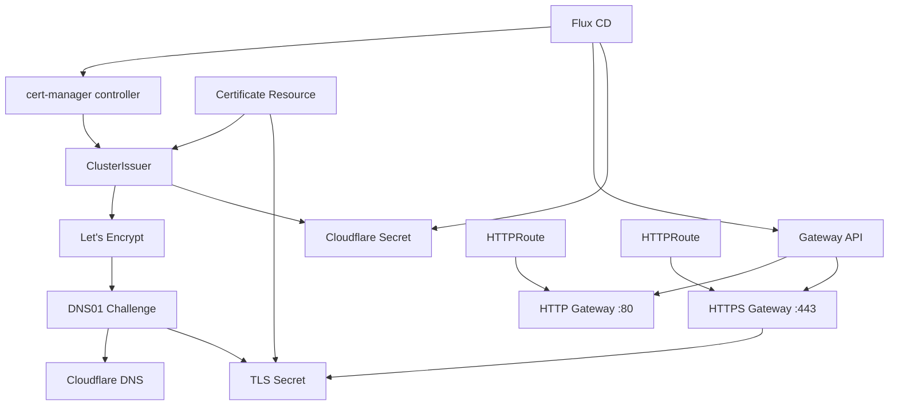

# Cert-Manager y Gateway con TLS

Esta guía explica la configuración de cert-manager para la generación automática de certificados TLS utilizando Let's Encrypt y Cloudflare como proveedor DNS, junto con la configuración de Gateway API para enrutamiento de tráfico seguro.

> ⏱️ Tiempo estimado de implementación: Todo está configurado mediante Flux CD

---

## 📋 Requisitos previos

Antes de que cert-manager funcione correctamente, es necesario configurar:

- Clúster Kubernetes con Flux CD instalado y funcionando
  - 📖 Ver: [Talos Bootstrap](talos-bootstrap.md) y [Bootstrap FluxCD SOPS Age](bootstrap-fluxcd-sops-age.md)
- Cilium API Gateway configurado y operativo
  - 📖 Ver: [Cilium API Gateway](cilium-api-gateway.md)
- Token de API de Cloudflare con permisos de edición de DNS
- Dominio configurado en Cloudflare

---

## 🔧 Configuración del entorno

### ConfigMap del clúster

Primero es necesario crear un ConfigMap con la configuración global del clúster que será utilizada por todos los componentes:

```yaml
apiVersion: v1
data:
  ADMIN_EMAIL: admin@mydomain.com
  DOMAIN: mydomain.com
kind: ConfigMap
metadata:
  name: cluster-config
  namespace: flux-system
```

> **Importante**: Reemplaza `admin@mydomain.com` por tu email y `mydomain.com` por tu dominio antes de aplicar.

Esta configuración es referenciada mediante sustituciones de variables (`${ADMIN_EMAIL}` y `${DOMAIN}`) en todos los manifiestos de Kubernetes.

---

## 🔐 Gestión de secretos con SOPS

### Secreto de API de Cloudflare

El secreto [`cloudflare-api-key.yaml`](../infrastructure/base/secrets/cloudflare-api-key.yaml) contiene el token de API de Cloudflare cifrado con SOPS:

```yaml
apiVersion: v1
kind: Secret
metadata:
    name: cloudflare-api-key-secret
    namespace: cert-manager
type: Opaque
stringData:
    api-key: ENC[AES256_GCM,data:...] # Token cifrado con SOPS
```

**Funcionalidad**:
- Almacena de forma segura el token de API de Cloudflare
- Cifrado con Age mediante SOPS para proteger credenciales sensibles
- Utilizado por cert-manager para validación DNS01 con Let's Encrypt
- Desplegado automáticamente en el namespace `cert-manager`

> **⚠️ Importante para nuevas instalaciones**: Si clonas este repositorio para montar tu propio clúster, debes reemplazar el valor cifrado `ENC[AES256_GCM,data:...]` por tu propio token de API de Cloudflare y cifrarlo con tu propia clave Age de SOPS configurada en los pasos previos de la documentación de bootstrap. El token debe tener permisos de `Zone:Zone:Read` y `Zone:DNS:Edit` para el dominio configurado.

**Para actualizar el secreto en tu instalación**:
```bash
# 1. Edita el archivo con tu token real
vim infrastructure/base/secrets/cloudflare-api-key.yaml

# 2. Cifra el archivo con tu clave Age
sops --encrypt --in-place infrastructure/base/secrets/cloudflare-api-key.yaml
```

---

## 📜 Cert-Manager: Controlador de certificados

Cert-manager es un controlador de Kubernetes que automatiza la gestión y renovación de certificados TLS.

### Componentes del controlador

La configuración de cert-manager se encuentra en [`infrastructure/base/controllers/cert-manager/`](../infrastructure/base/controllers/cert-manager/):

#### 1. Namespace
```yaml
# namespace.yaml
apiVersion: v1
kind: Namespace
metadata:
  name: cert-manager
```

#### 2. Repositorio Helm
```yaml
# repository.yaml
apiVersion: source.toolkit.fluxcd.io/v1
kind: HelmRepository
metadata:
  name: cert-manager
  namespace: cert-manager
spec:
  interval: 24h
  url: https://charts.jetstack.io
```

#### 3. Release Helm
```yaml
# release.yaml
apiVersion: helm.toolkit.fluxcd.io/v2
kind: HelmRelease
metadata:
  name: cert-manager
  namespace: cert-manager
spec:
  chart:
    spec:
      chart: cert-manager
      version: "1.17"
  values:
    installCRDs: true
```

**Funcionalidad**:
- **Automatización**: Genera y renueva certificados automáticamente
- **Integración**: Se conecta con Let's Encrypt para certificados gratuitos
- **Validación DNS**: Utiliza Cloudflare para validación DNS01 (soporta wildcards)
- **Gestión del ciclo de vida**: Maneja creación, renovación y revocación de certificados

---

## 🚪 Gateway API: Enrutamiento y terminación TLS

### ClusterIssuer: Emisor de certificados

El [`ClusterIssuer`](../infrastructure/base/configs/gateway/cluster-issuers.yaml) configura cómo cert-manager obtiene certificados de Let's Encrypt:

```yaml
apiVersion: cert-manager.io/v1
kind: ClusterIssuer
metadata:
  name: letsencrypt
spec:
  acme:
    email: "${ADMIN_EMAIL}"
    server: https://acme-v02.api.letsencrypt.org/directory
    privateKeySecretRef:
      name: letsencrypt-issuer
    solvers:
      - dns01:
          cloudflare:
            email: "${ADMIN_EMAIL}"
            apiTokenSecretRef:
              name: cloudflare-api-key-secret
              key: api-key
```

**Características**:
- **Alcance global**: Disponible en todos los namespaces del clúster
- **Proveedor ACME**: Utiliza Let's Encrypt como autoridad certificadora
- **Validación DNS01**: Permite certificados wildcard (`*.dominio.com`)
- **Integración Cloudflare**: Automatiza la creación de registros DNS para validación

### Certificate: Solicitud de certificado

El recurso [`Certificate`](../infrastructure/base/configs/gateway/certificate.yaml) define qué certificado solicitar:

```yaml
apiVersion: cert-manager.io/v1
kind: Certificate
metadata:
  name: cert-quantum
  namespace: gateway
spec:
  secretName: secret-quantum-cert
  issuerRef:
    name: letsencrypt
    kind: ClusterIssuer
  dnsNames:
    - "*.${DOMAIN}"
```

**Funcionalidad**:
- **Certificado wildcard**: Cubre todos los subdominios (`*.dominio.com`)
- **Almacenamiento**: Guarda el certificado en un Secret de Kubernetes
- **Renovación automática**: cert-manager renueva antes del vencimiento
- **Referencia al emisor**: Utiliza el ClusterIssuer configurado

### Gateway: Puntos de entrada del clúster

#### HTTP Gateway
```yaml
apiVersion: gateway.networking.k8s.io/v1
kind: Gateway
metadata:
  name: http-gateway
spec:
  gatewayClassName: cilium
  listeners:
  - name: http-listener
    protocol: HTTP
    port: 80
```

#### HTTPS Gateway
```yaml
apiVersion: gateway.networking.k8s.io/v1
kind: Gateway
metadata:
  name: tls-gateway
spec:
  gatewayClassName: cilium
  listeners:
  - name: https-listener
    protocol: HTTPS
    port: 443
    hostname: "${DOMAIN}"
    tls:
      certificateRefs:
      - kind: Secret
        name: secret-quantum-cert
```

**Funcionalidades**:
- **Terminación TLS**: El HTTPS Gateway maneja la terminación SSL/TLS
- **Enrutamiento**: Cilium enruta el tráfico según las reglas definidas
- **Balanceador de carga**: Distribuye el tráfico entre los pods backend
- **Certificado automático**: Utiliza el certificado generado por cert-manager

---

## 🔄 Flujo de trabajo automatizado

### 1. Despliegue con Flux CD
Flux CD sincroniza automáticamente toda la configuración desde este repositorio:

```
infrastructure/base/controllers/cert-manager/ → Instala cert-manager
infrastructure/base/secrets/ → Despliega secretos cifrados
infrastructure/base/configs/gateway/ → Configura Gateway API y certificados
```

### 2. Proceso de certificación
1. **cert-manager** detecta el recurso `Certificate`
2. **ClusterIssuer** inicia el proceso ACME con Let's Encrypt
3. **Validación DNS01**: Se crea un registro TXT temporal en Cloudflare
4. **Let's Encrypt** valida el control del dominio
5. **Certificado generado**: Se almacena en el Secret especificado
6. **Gateway utiliza el certificado**: Para terminación TLS en el puerto 443

### 3. Renovación automática
- cert-manager monitorea la fecha de vencimiento
- Inicia renovación automática 30 días antes del vencimiento
- El nuevo certificado se actualiza en el mismo Secret
- Gateway utiliza automáticamente el certificado renovado

---

## ✅ Verificación del funcionamiento

Una vez que Flux haya sincronizado toda la configuración, puedes verificar el estado:

```bash
# Verificar que cert-manager está funcionando
kubectl get pods -n cert-manager

# Verificar el estado del certificado
kubectl get certificate -n gateway

# Verificar que el secreto contiene el certificado
kubectl describe secret secret-quantum-cert -n gateway

# Verificar los Gateways
kubectl get gateway -n gateway
```

---

## 🌐 Trabajando con Gateways y rutas

### Obtener las IPs de los Gateways

Para conocer las direcciones IP asignadas a tus Gateways:

```bash
# Ver información detallada de los Gateways
kubectl get gateway -n gateway -o wide

# Obtener las IPs específicas de cada Gateway
kubectl get gateway http-gateway -n gateway -o jsonpath='{.status.addresses[0].value}'
kubectl get gateway tls-gateway -n gateway -o jsonpath='{.status.addresses[0].value}'

# Ver todos los servicios LoadBalancer de Cilium
kubectl get svc -n kube-system -l io.cilium/gateway-owning-gateway
```

### Crear rutas HTTPRoute

Para enrutar tráfico a una aplicación (ejemplo con nginx), crea un `HTTPRoute`:

```yaml
# httproute-nginx.yaml
apiVersion: gateway.networking.k8s.io/v1
kind: HTTPRoute
metadata:
  name: nginx-route
  namespace: default
spec:
  parentRefs:
  - name: http-gateway
    namespace: gateway
  - name: tls-gateway
    namespace: gateway
  hostnames:
  - "nginx.${DOMAIN}"
  rules:
  - matches:
    - path:
        type: PathPrefix
        value: /
    backendRefs:
    - name: nginx-service
      port: 80
```

### Ejemplo completo: Desplegar nginx con rutas

#### 1. Despliegue básico de nginx
```yaml
# nginx-deployment.yaml
apiVersion: apps/v1
kind: Deployment
metadata:
  name: nginx
  namespace: default
spec:
  replicas: 2
  selector:
    matchLabels:
      app: nginx
  template:
    metadata:
      labels:
        app: nginx
    spec:
      containers:
      - name: nginx
        image: nginx:latest
        ports:
        - containerPort: 80
---
apiVersion: v1
kind: Service
metadata:
  name: nginx-service
  namespace: default
spec:
  selector:
    app: nginx
  ports:
  - port: 80
    targetPort: 80
  type: ClusterIP
```

#### 2. HTTPRoute para nginx
```yaml
# nginx-httproute.yaml
apiVersion: gateway.networking.k8s.io/v1
kind: HTTPRoute
metadata:
  name: nginx-route
  namespace: default
spec:
  parentRefs:
  - name: http-gateway
    namespace: gateway
  - name: tls-gateway
    namespace: gateway
  hostnames:
  - "nginx.${DOMAIN}"
  rules:
  - matches:
    - path:
        type: PathPrefix
        value: /
    backendRefs:
    - name: nginx-service
      port: 80
```

### Probar las rutas con curl

Una vez desplegado, puedes probar el acceso:

```bash
# Obtener la IP del Gateway HTTP
GATEWAY_IP=$(kubectl get gateway http-gateway -n gateway -o jsonpath='{.status.addresses[0].value}')

# Probar HTTP (puerto 80)
curl -H "Host: nginx.tudominio.com" http://$GATEWAY_IP/

# Obtener la IP del Gateway HTTPS
TLS_GATEWAY_IP=$(kubectl get gateway tls-gateway -n gateway -o jsonpath='{.status.addresses[0].value}')

# Probar HTTPS (puerto 443) - requiere certificado válido
curl -H "Host: nginx.tudominio.com" https://$TLS_GATEWAY_IP/

# Si usas certificados Let's Encrypt en desarrollo, puedes ignorar la verificación SSL
curl -k -H "Host: nginx.tudominio.com" https://$TLS_GATEWAY_IP/
```

### Redirección automática HTTP → HTTPS

Para redirigir todo el tráfico HTTP a HTTPS, puedes usar esta configuración:

```yaml
# redirect-to-https.yaml
apiVersion: gateway.networking.k8s.io/v1
kind: HTTPRoute
metadata:
  name: redirect-to-https
  namespace: default
spec:
  parentRefs:
  - name: http-gateway
    namespace: gateway
  hostnames:
  - "nginx.${DOMAIN}"
  rules:
  - filters:
    - type: RequestRedirect
      requestRedirect:
        scheme: https
        statusCode: 301
```

### Troubleshooting de rutas

Comandos útiles para diagnosticar problemas:

```bash
# Ver el estado de las HTTPRoutes
kubectl get httproute -A

# Describir una ruta específica
kubectl describe httproute nginx-route -n default

# Ver logs de Cilium Gateway
kubectl logs -n kube-system -l k8s-app=cilium --tail=100

# Verificar conectividad desde un pod
kubectl run debug --image=curlimages/curl -it --rm -- /bin/sh
# Dentro del pod:
curl http://nginx-service.default.svc.cluster.local/
```

### Configuración DNS

Para acceso desde fuera del clúster, configura tu DNS para apuntar a la IP del Gateway:

```bash
# En tu proveedor DNS (Cloudflare, etc.)
nginx.tudominio.com → IP_DEL_GATEWAY
*.tudominio.com → IP_DEL_GATEWAY  # Para wildcard
```

---

## 🔗 Relación entre componentes



Todos los componentes trabajan en conjunto para proporcionar certificados TLS automáticos y enrutamiento seguro, gestionados completamente a través de GitOps con Flux CD.


